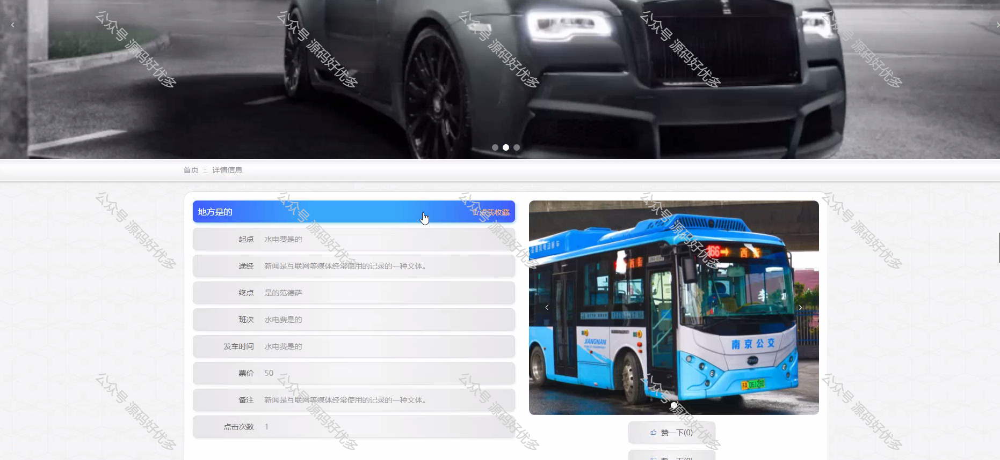

 
## 查看主页获取源码

### 一、作品包含

源码+数据库+设计文档万字+PPT+全套环境和工具资源+部署教程

### 二、项目技术

前端技术：Html、Css、Js、Vue、Element-ui

数据库：MySQL

后端技术：Java、Spring Boot、MyBatis

  

### 三、运行环境

开发工具：IDEA/eclipse

数据库：MySQL5.7

数据库管理工具：Navicat10以上版本

环境配置软件： JDK1.8+Maven3.6.3

前端Nodejs：14

### 四、项目介绍
项目编号：springbootA207

城市公交查询系统作为智慧城市建设的重要组成部分，旨在为市民提供便捷、高效的公共交通信息服务。该系统通过整合实时公交位置、线路查询、站点信息、时间预报等功能，帮助乘客规划出行路线，减少等待时间，提高出行效率，从而促进绿色出行理念的普及，缓解城市交通压力，提升市民的出行体验。

前台用户功能：浏览首页、公交路线、车次信息、公交站点、换乘方案、公告信息、留言板、后台管理、在线咨询和个人中心。

后台管理员的功能：系统首页、个人中心、用户管理、公交路线管理、车次信息管理、公交站点管理、换乘方案管理、留言板管理、系统管理。

### 五、运行截图

  
